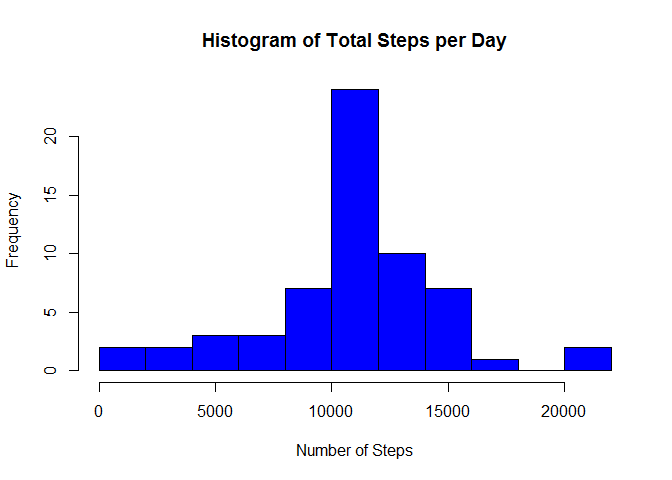

# Reproducible Research: Peer Assessment 1

## Class project Overview
This project demonstrates the ability to create a document with embedded code.
For this example all code will be displayed but it is not necessary.
This project uses a data set provided on the Cousera web site, it was downloaded 
on May-14-2016 at this URL: 
https://d396qusza40orc.cloudfront.net/repdata%2Fdata%2Factivity.zip

The following libraies are used: **dplyr, lattice and ggplot2**


```r
        library(dplyr, quietly = TRUE ,warn.conflicts = FALSE)
        library(lattice, quietly = TRUE ,warn.conflicts = FALSE)
        library(ggplot2, quietly = TRUE ,warn.conflicts = FALSE)
```

```
## Warning: package 'ggplot2' was built under R version 3.2.4
```

## Loading and preprocessing the data

Create data set named "myData" by reading data file into envioroment with "read.csv"
        (assumes data set is located in the current working directory)

```r
        myData <- read.csv("activity.csv", header = TRUE, sep = "," ,dec = "." )
```


Create data set named "interval_Data" of the average number of steps of each interval, 
the original data set "myData" is grouped by interval using "grouped_by", the varible 
names are given better descriptive names using "rename" , then the data set is created using summarize.


```r
        interval_Data <- group_by(myData, interval) %>%
                rename(Average_Steps = steps, Interval = interval) %>%
                        summarize( Average_Steps = mean(Average_Steps, na.rm = TRUE))
```


## What is mean total number of steps taken per day?
Create data set named "sum_Data" representing the total steps recorded each day using "tapply"

```r
        sum_Data <- tapply(myData$steps, myData$date, sum, na.rm=TRUE)
```

Inspect the data set by making a Histogram to show the distribution of the total steps each day 


```r
        hist(sum_Data, col = "blue", main = "Histogram of Total Steps per Day", 
                xlab = "Number of Steps", breaks = 10)
```


Calculate Mean and Median of the daliy toal steps

```r
        meanData <- as.integer(mean(sum_Data, na.rm = TRUE))
        medianData <- as.integer(median(sum_Data, na.rm = TRUE))
```
* The mean of the total number of steps taken per day is: **9354**
* The median of the total number of steps taken per day is: **10395**

## What is the average daily activity pattern?
Create a plot of the average number of steps taken during each interval

```r
        g <- ggplot( data = interval_Data, aes( Interval, Average_Steps) )
        g + geom_line(colour = "blue") + labs(title = "Time Series of Average Steps Taken") +
        labs(x = "Interval  [5 minutes]", y = "Number of Steps Taken")
```


Find the interval with the maximum average value

```r
        maxValue <- max(interval_Data$Average_Steps, na.rm = TRUE)
        maxInterval <- interval_Data$Interval[interval_Data$Average_Steps==maxValue] 
```
* The interval with the maxium value is: **835**

## Imputing missing values

Calculate total number of missing values "NA's" in the data set using "is.na"

```r
        missing <- sum(is.na(myData$steps))
```
*  The total number of missing values in the data is: **2304**

Create new data set named "completeData" 

```r
        completeData <- myData
```

Find NA's in data set "completeData" 

```r
        whereNA <- is.na(completeData$steps)
```


Replace NA's with interval average from the data set "interval_Data"

```r
for(i in 1:length(whereNA)){
        if(whereNA[i] == TRUE){
                myInterval <- completeData$interval[i]
                myValue <- interval_Data$Average_Steps[interval_Data$Interval==myInterval] 
                completeData$steps[i] <- myValue
                }
}
```

Create data set named "newSum_Data" representing the total steps recorded each day using "tapply"

```r
        newSum_Data <- tapply(completeData$steps, completeData$date, sum)
```

Inspect the data set by making a Histogram to show the distribution of the total steps each day 


```r
        hist(newSum_Data, col = "blue", main = "Histogram of Total Steps per Day", xlab = "Number of Steps", breaks = 10)
```



Calculate Mean and Median of the daliy toal steps

```r
        new_meanData <- as.integer(mean(newSum_Data, na.rm = TRUE))
        new_medianData <- as.integer(median(newSum_Data, na.rm = TRUE))
```
* The mean of the total number of steps taken per day is: **10766**
* The median of the total number of steps taken per day is: **10766**

## Are there differences in activity patterns between weekdays and weekends?
Determine name of weekdays using "weekdays"

```r
        completeData$date <- as.Date.factor(completeData$date)
        which_Day <- weekdays(completeData$date)
```

Update dates by replacing date names with "Weekday" or "Weekend" 

```r
for(i in 1:length(which_Day)){
        if(as.character(which_Day[i])== "Saturday" | as.character(which_Day[i])== "Sunday"){
                which_Day[i] <- "Weekend"       
                
        }else{
                which_Day[i] <- "Weekday"
        }
}
```


Merge updated dates into dataset and transform into data.frame

```r
        which_Day <- factor(which_Day,levels=c('Weekend', 'Weekday')) 
        completeData$date <- which_Day
        dateData <- data.frame(completeData)
```


Create dataset of interval averages with updated date names

```r
        weekDay_Data= subset(dateData,date == "Weekday")
        weekEnd_Data= subset(dateData,date == "Weekend")
        week1 = aggregate(steps ~ interval + date, data = weekDay_Data, FUN = "mean" )
        week2 = aggregate(steps ~ interval + date, data = weekEnd_Data, FUN = "mean" )
        combinedData <- rbind.data.frame(week1,week2)
```


Plot data to compare weekend and weekday interval averages

```r
        xyplot(steps ~ interval | date, data = combinedData, layout = c(1,2),type = "l")
```


